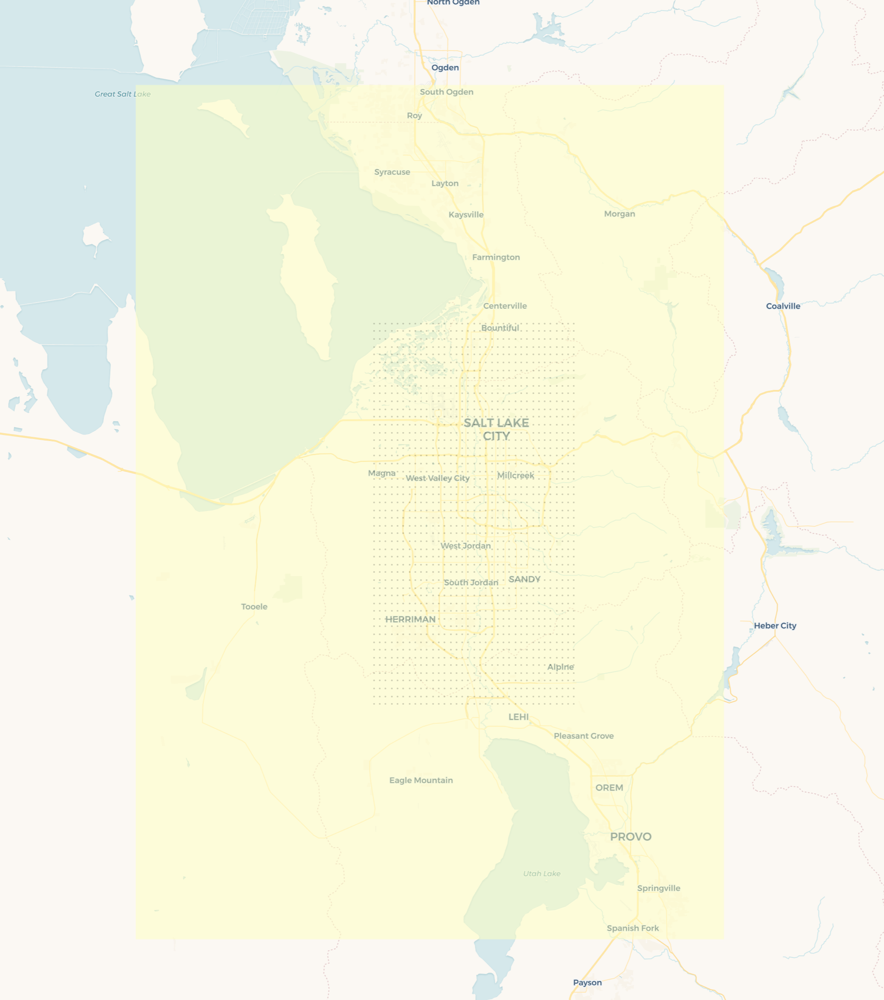

# Air Tracker domain registry

This repository is home to [`domains.yaml`](domains.yaml), which configures the STILT simulations used to generate and cache footprints for real-time consumption using forecast meteorology.

## Domain schema

A domain definition looks like

```yaml
salt_lake_city:
  is_enabled: true
  receptor_grid:
    xmin: -112.1
    xmax: -111.75
    xres: 0.01
    ymin: 40.4
    ymax: 40.9
    yres: 0.01
  footprint_grid:
    xmin: -112.5
    xmax: -111.5
    xres: 0.002
    ymin: 40.1
    ymax: 41.2
    yres: 0.002
  stilt_config:
    n_hours: -4
    numpar: 200
    time_integrate: true
```

This configures a `salt_lake_city` domain, where receptors placed on the vertices of `receptor_grid` (inclusive of boundaries) are used to generate footprints over the `footprint_grid`.

<p align="center">
</img>
</p>

For our example domain definition, the `receptor_grid` defines the black circles and the `footprint_grid` defines the yellow area.

### Modifying the domain definitions

Open [`domains.yaml`](domains.yaml) and make your edits. You'll need to submit a pull request to validate the configuration before changes will be detected by the STILT simulation service.
